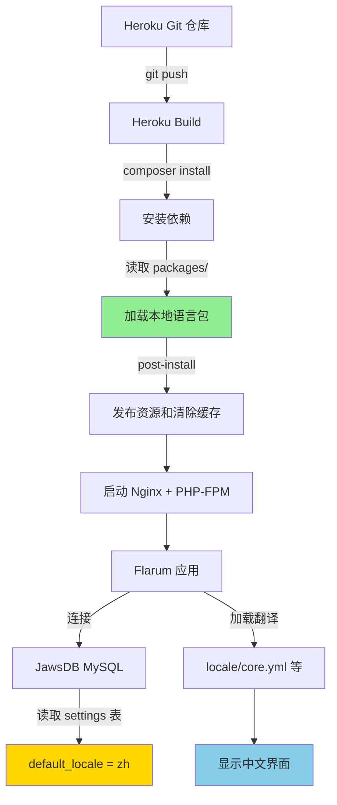

# Flarum 中文支持启用方案

## 📋 项目现状分析

### ✅ 已完成部分

1. **中文语言包已创建**
   - 路径: `packages/lang-chinese-simplified/`
   - 包含完整的核心翻译 (763行中文翻译)
   - 已包含11个官方扩展的中文翻译

2. **已在 Composer 中注册**
   - 在 `composer.json` 第54行已添加: `"local/lang-chinese-simplified": "*"`
   - 使用本地路径仓库配置

3. **已有的中文翻译文件**
   - ✅ `core.yml` - 核心界面
   - ✅ `flarum-approval.yml` - 内容审核
   - ✅ `flarum-flags.yml` - 举报功能
   - ✅ `flarum-likes.yml` - 点赞功能
   - ✅ `flarum-lock.yml` - 锁定帖子
   - ✅ `flarum-mentions.yml` - @提及功能
   - ✅ `flarum-nicknames.yml` - 昵称功能
   - ✅ `flarum-sticky.yml` - 置顶功能
   - ✅ `flarum-subscriptions.yml` - 订阅功能
   - ✅ `flarum-suspend.yml` - 封禁功能
   - ✅ `flarum-tags.yml` - 标签功能

### ⚠️ 缺失的翻译文件

项目中安装了以下扩展但缺少中文翻译:

- ❌ `flarum-bbcode.yml` - BBCode 格式支持
- ❌ `flarum-emoji.yml` - Emoji 表情支持
- ❌ `flarum-gdpr.yml` - GDPR 隐私合规
- ❌ `flarum-markdown.yml` - Markdown 格式支持
- ❌ `flarum-messages.yml` - 私信功能
- ❌ `flarum-pusher.yml` - 实时推送
- ❌ `flarum-statistics.yml` - 统计功能

---

## 🎯 启用中文支持的步骤

### 步骤 1: 安装语言包依赖

由于语言包已经在 `composer.json` 中配置,需要运行安装命令:

```bash
composer install --no-dev --optimize-autoloader
```

**Heroku 注意事项**: 
- Heroku 在部署时会自动运行 `composer install`
- 确保 `composer.json` 和 `composer.lock` 都已提交到 Git

### 步骤 2: 清除缓存并发布资源

```bash
php flarum cache:clear
php flarum assets:publish
```

**Heroku 注意事项**:
- 这些命令已在 `composer.json` 的 `post-install-cmd` 中配置
- 每次部署后会自动执行

### 步骤 3: 在后台启用中文语言包

有两种方式启用中文:

#### 方式 A: 通过管理后台 (推荐)

1. 访问论坛管理后台: `https://你的域名/admin`
2. 点击左侧菜单 **"扩展"** (Extensions)
3. 找到 **"简体中文"** 语言包
4. 点击 **"启用"** (Enable) 按钮
5. 进入 **"基本设置"** (Basics)
6. 在 **"默认语言"** 下拉菜单中选择 **"简体中文"**
7. 点击 **"保存更改"**

#### 方式 B: 通过数据库直接设置 (高级)

如果无法访问管理后台,可以直接修改数据库:

```sql
-- 设置默认语言为中文
UPDATE settings SET value = 'zh' WHERE key = 'default_locale';

-- 启用语言包扩展
INSERT INTO settings (key, value) 
VALUES ('extensions_enabled', '["local-lang-chinese-simplified"]')
ON DUPLICATE KEY UPDATE value = JSON_ARRAY_APPEND(value, '$', 'local-lang-chinese-simplified');
```

**Heroku JawsDB 连接方式**:

```bash
# 方式1: 使用 Heroku CLI
heroku run php flarum info

# 方式2: 通过环境变量获取数据库信息
heroku config:get JAWSDB_URL
```

### 步骤 4: 验证语言包是否生效

#### 前端验证

1. 访问论坛首页
2. 检查页面顶部是否出现语言选择器
3. 选择 **"简体中文"** 
4. 检查界面是否显示为中文

#### 后端验证

```bash
# 检查已启用的扩展
php flarum info

# 检查语言包文件
ls -la packages/lang-chinese-simplified/locale/
```

---

## 🔧 补充缺失的中文翻译

### 需要添加的翻译文件

创建以下文件以支持所有已安装的扩展:

1. `packages/lang-chinese-simplified/locale/flarum-bbcode.yml`
2. `packages/lang-chinese-simplified/locale/flarum-emoji.yml`
3. `packages/lang-chinese-simplified/locale/flarum-gdpr.yml`
4. `packages/lang-chinese-simplified/locale/flarum-markdown.yml`
5. `packages/lang-chinese-simplified/locale/flarum-messages.yml`
6. `packages/lang-chinese-simplified/locale/flarum-pusher.yml`
7. `packages/lang-chinese-simplified/locale/flarum-statistics.yml`

### 翻译文件模板

每个翻译文件的基本结构:

```yaml
扩展名称:
  
  forum:
    # 前端用户界面翻译
    
  admin:
    # 后台管理界面翻译
    
  ref:
    # 可复用的翻译引用
```

---

## 🚀 Heroku 部署特别说明

### Procfile 配置

检查 `Procfile` 文件内容:

```
web: vendor/bin/heroku-php-nginx -C .nginx.conf public/
```

### 环境变量设置

确保设置了以下 Heroku 环境变量:

```bash
# 应用 URL
heroku config:set APP_URL=https://你的应用.herokuapp.com

# 数据库 (JawsDB 自动设置)
# JAWSDB_URL=mysql://用户:密码@主机:端口/数据库名

# 可选: 调试模式 (生产环境应设为 false)
heroku config:set FLARUM_DEBUG=false
```

### 部署流程

```bash
# 1. 提交更改
git add .
git commit -m "Add Chinese language support"

# 2. 推送到 Heroku
git push heroku main

# 3. 检查部署日志
heroku logs --tail

# 4. 清除缓存 (如需要)
heroku run php flarum cache:clear
```

### 常见问题排查

#### 问题1: 语言包未显示

```bash
# 检查扩展是否正确安装
heroku run php flarum info

# 重新发布资源
heroku run php flarum assets:publish
heroku run php flarum cache:clear

# 重启应用
heroku restart
```

#### 问题2: 文件权限问题

Heroku 的文件系统是临时的,每次部署都会重置。确保:
- 不要在运行时写入文件到应用目录
- 使用数据库或外部存储保存用户数据

#### 问题3: 内存不足

```bash
# 检查内存使用
heroku ps

# 如需升级 dyno
heroku ps:resize web=standard-1x
```

---

## 📊 系统架构图



---

## ✅ 验证清单

启用中文支持后,逐一检查以下项目:

- [ ] Composer 已安装语言包依赖
- [ ] 语言包在管理后台中显示并已启用
- [ ] 默认语言已设置为 "简体中文"
- [ ] 前端页面显示中文界面
- [ ] 用户可以通过语言选择器切换语言
- [ ] 管理后台显示中文界面
- [ ] 邮件通知使用中文
- [ ] 所有已安装扩展都有对应的中文翻译
- [ ] Heroku 部署后中文设置保持有效

---

## 📚 后续优化建议

### 1. 完善翻译覆盖

为缺失的7个扩展添加中文翻译文件,确保100%中文化

### 2. 持续更新

- 关注 Flarum 官方翻译项目更新
- 定期同步最新的中文翻译

### 3. 性能优化

```bash
# 使用生产环境优化
composer install --no-dev --optimize-autoloader

# 启用 OPcache (Heroku 默认已启用)
```

### 4. 监控和日志

```bash
# 实时查看日志
heroku logs --tail --source app

# 查看特定错误
heroku logs --tail | grep ERROR
```

---

## 🆘 需要帮助?

如果遇到问题,可以:

1. 查看 Flarum 官方文档: https://docs.flarum.org/
2. 访问 Flarum 中文社区: https://discuss.flarum.org/t/chinese
3. 检查 Heroku 应用日志: `heroku logs --tail`
4. 验证数据库连接: `heroku run php flarum info`

---

## 📝 总结

你的项目已经具备了完整的中文语言包基础设施,只需要:

1. ✅ 确保 composer 依赖已安装
2. ✅ 在管理后台启用语言包
3. ✅ 设置默认语言为中文
4. ⚠️ (可选) 补充7个缺失扩展的中文翻译

由于项目部署在 Heroku 上,大部分步骤会在部署时自动完成,你主要需要通过管理后台进行配置即可。
